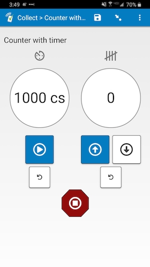

# Counter with timer

|||||
|:---:|:---:|:---:|:---:|
|Running|Warning|End early|Ended|

## Description

*Requires at least Android 7 or iOS 13 to work in SurveyCTO Collect mobile.*

Use this field plug-in to add a timer to your field. It also includes a counter you can use to keep track of something while timing, with buttons to both count up and count down. You can use it to count words read, number of mistakes, or whatever else you need to count. The count will never go below 0.

If an enumerator uses one of the reset buttons or the "End early" button (the hex octogon with a circle and square inside), they will have to confirm the reset/ending.

An answer is not set until the timer runs out, or "End early" is confirmed, so the enumerator cannot move on from that field until then. If they leave the field, they can come back and continue where they left off with the same amount of time left and the same count value. If they end early and come back, and the time left and/or counter value is changed, they will need to tap/click the "End early" button again to save a new answer, or let the timer run out.

You can customize the timer duration and unit used. See **Parameters** below for more details.

### Feature list

* Timer for keeping track of time remaining
* Parameter for specifying starting time
* Button to start and pause timer as needed
* Button to increase counter value, and button to decrease value (cannot go below 0)
* Button to reset timer
* Button to reset counter
* Warning when about to reset the counter or timer
* Customization of unit for timer

### Data format

Both the count and the time remaining are stored in a space-separated list:

    [count] [time (in ms)]

For example, if the count is set to 6, and the timer has 3,856 milliseconds remaining, the field will have this value:

    6 3856

The time is always saved in milliseconds, even if the display is set to another unit. You can use the `selected-at()` function in order to get each individual value. For example, if the field is called "timer1", you can use this expression to get the counter value:

    selected-at(${timer1}, 0)

The field value is re-stored whenever the timer time or counter value has changed. The enumerator/respondent can come back and continue where they left off with the same amount of time passed and the same count value. For example, if the enumerator leaves the field with 5 seconds remaining, even while the timer is still running, when they return, the timer will still say 5 seconds have passed.

This field plug-in also inherits functionality from the [baseline-text](https://github.com/surveycto/baseline-text) field plug-in.

## How to use

### Getting started

**To use this field plug-in as-is:**

1. Download the [sample form](extras/sample-form) from this repo and upload it to your SurveyCTO server.
1. Download the [counterwithtimer.fieldplugin.zip](https://github.com/surveycto/counter-with-timer/raw/master/counterwithtimer.fieldplugin.zip) file from this repo, and attach it to the sample form on your SurveyCTO server.
1. Adjust the parameter if you would like to use a different unit (see below).

### Parameters

This field takes two parameters:

|Name|Description|Default|
|:---|:---|:---|
|`duration` (optional)|Duration in seconds|`10`|
|`time-unit` (optional)|Display unit for the time|`s`|

For the timer, no matter the unit you are using, the duration must be given in seconds. For example, if you would like the duration to be 20 seconds, the value of this parameter will be `20`. If you would like the duration to be 5,500 milliseconds, the parameter should be `5.5`.

If no duration is specified, it will default to 10 seconds. If no unit is specified, it will display the time in seconds.

You can use the following display units:  
|**Abbr.**|**Full name**|**Unit in 1 second**|
|:---|:---|:---|
|`s`|seconds|1
|`ds`|deciseconds|10
|`cs`|centiseconds|100
|`ms`|milliseconds|1000

For example, if you use the following *appearance*:

    custom-countertimer(duration=15, unit='cs')

Even though the duration entered is 15 seconds, it will be displayed as "1500 cs" before the timer starts.

### Default SurveyCTO feature support

| Feature / Property | Support |
| --- | --- |
| Supported field type(s) | `text`|
| Default values | Yes |
| Custom constraint message | No |
| Custom required message | No |
| Read only | No |
| media:image | Yes |
| media:audio | Yes |
| media:video | Yes |
| `number` appearance | No |
| `numbers_decimal` appearance | No |
| `numbers_phone` appearance | No |
| `show_formatted` appearance | No |

## More resources

* **Sample form**  
You can find a form definition in this repo here: [extras/sample-form](extras/sample-form).

* **Developer documentation**  
More instructions for developing and using field plug-ins can be found here: [https://github.com/surveycto/Field-plug-in-resources](https://github.com/surveycto/Field-plug-in-resources)